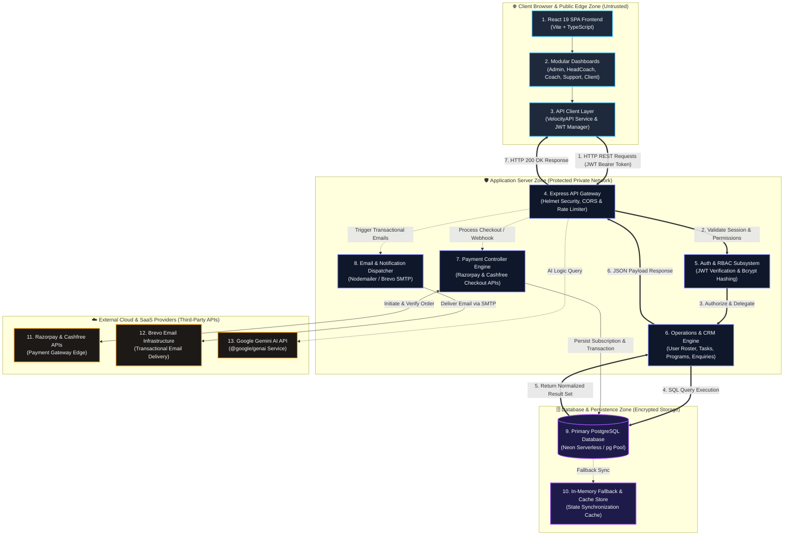

# BxStrength Platform - System Architecture & Runtime Diagram

## 🏗️ System Architecture Overview

The **BxStrength Platform** is structured as a full-stack, decoupled Web Application featuring a high-performance React 19 + TypeScript Single Page Application (SPA) on the frontend and an Express.js RESTful API engine on the backend with PostgreSQL data persistence, multi-gateway payment processing (Razorpay & Cashfree), and role-based access control (RBAC).

---

## 📊 Runtime Architecture Diagram (Core Components & Trust Boundaries)

---

## 🔁 Primary Request & Data Execution Path

The diagram highlights the primary client data path (indicated by thick double arrows `==>`) for authenticated user interactions (e.g. Client viewing workout plans, Admin modifying user roles, Support handling inquiries):

1. **Client Request**: User performs an action in the frontend UI (`DashModules`), which invokes the central `VelocityAPI` service (`APIClient`).
2. **Transmission**: `APIClient` attaches the `Authorization: Bearer <jwt_token>` header and executes an asynchronous `fetch()` to `ExpressApp`.
3. **Security Gate**: `ExpressApp` runs Helmet HTTP security headers check, CORS validation, and rate limiting before handing off to `AuthSystem`.
4. **Authentication & Authorization**: `AuthSystem` verifies the JWT signature and checks user role permissions against RBAC policies.
5. **Business Logic Execution**: `CRMEngine` executes the domain logic (e.g., retrieving active subscriptions, client rosters, assigned tasks).
6. **Data Persistence**: `CRMEngine` executes parameterized SQL queries against `PostgresDB` via the `pg` pool.
7. **Response Assembly**: `PostgresDB` returns query results to `CRMEngine`, which formats the JSON payload and responds to `APIClient` with HTTP 200 OK.

---

## 🔍 Core Component Specification Cards

Below is the detailed technical specification for each core runtime component:

| Component ID & Name | Trust Zone | Technology Stack | Key Responsibilities & Capabilities |
| :--- | :--- | :--- | :--- |
| **1. React 19 SPA Frontend** | Client Browser | React 19, TypeScript, Vite, TailwindCSS, Lucide Icons | Responsive UI rendering across desktop, tablet, and mobile; client-side routing and state management. |
| **2. Modular Dashboards** | Client Browser | React 19, TypeScript | 5 isolated dashboard modules (`src/dashboards/`): Admin, Head Coach, Coach, Customer Support, Client. |
| **3. API Client Layer** | Client Browser | TypeScript (`VelocityAPI` service) | Handles REST endpoints, token local storage, auto-retry logic, and error parsing. |
| **4. Express API Gateway** | App Server | Node.js, Express.js, Helmet, CORS, Express-Rate-Limit | Central API router (`/api/*`), HTTP security headers, payload body parsing (10MB limit), XSS sanitization. |
| **5. Auth & RBAC Subsystem** | App Server | JWT, Bcrypt.js, Custom Middleware | Password hashing, token signing & verification, strict role-based route enforcement. |
| **6. Operations & CRM Engine** | App Server | Node.js Express Controllers | Full operational management over users, coach assignments, client stats, workout/diet plans, and enquiries. |
| **7. Payment Controller** | App Server | Node.js, Razorpay Node SDK, Cashfree REST API | Order creation, payment signature validation, webhook verification, and subscription record updating. |
| **8. Email & Notification Service**| App Server | Nodemailer, EmailJS Service | Sending transactional emails (OTP verification, welcome messages, password resets, support ticket updates). |
| **9. Primary Database Storage** | Database Zone | PostgreSQL (Neon Serverless / `pg` pool) | Relational persistence for users, bookings, subscriptions, workout programs, nutrition plans, tickets, and logs. |
| **10. In-Memory Fallback & Cache**| Database Zone | Node.js Memory Objects | High-speed transient fallback for offline testing, rate limiting metrics, and fallback data structures. |
| **11. External Payment Gateways**| External SaaS | Razorpay & Cashfree APIs | Processing credit cards, UPI, net banking, checkout UI overlays, and webhook event notifications. |
| **12. Brevo Email Infrastructure**| External SaaS | Brevo SMTP | High-deliverability transactional email delivery network for transactional notifications. |
| **13. Google Gemini AI API** | External SaaS | `@google/genai` SDK | Powers AI logic widgets for automated customer assistance and personalized workout insights. |

---

## 🔒 Security & Trust Boundaries

1. **Client Browser Zone vs. Application Server Zone**:
   - The browser is considered an untrusted zone.
   - All input parameters (`req.body`, `req.query`, `req.params`) are strictly sanitized for XSS and validated on the backend.
   - Access control is enforced exclusively on the backend via JWT bearer tokens and RBAC middleware.

2. **Application Server Zone vs. Database Zone**:
   - Database connections use SSL encryption (`ssl: { rejectUnauthorized: false }`).
   - Parameterized SQL queries are mandatory to prevent SQL injection vulnerabilities.

3. **Application Server Zone vs. External SaaS Zone**:
   - Secret API Keys (`RAZORPAY_KEY_SECRET`, `JWT_SECRET`, `BREVO_SMTP_KEY`) are kept strictly confidential in server environment variables (`.env`).
   - Payment webhooks verify digital signatures (`HMAC-SHA256`) before updating subscription statuses.
